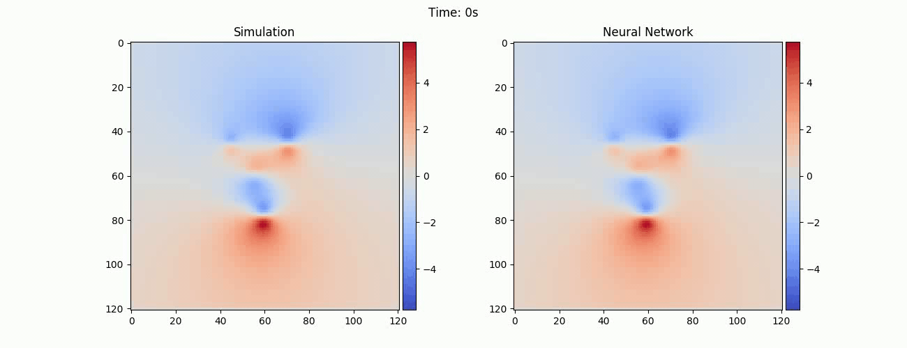

# Simulation of Fluid Flows based on Data-driven Evolution of Vortex Particles

This repository contains the code for my master thesis project for the masters programme Computational Sciences in Engineering (CSE) at TU Braunschweig.  
- [Report](https://www.dropbox.com/s/jrbpttt3a17pf1s/Report_revised_4868459.pdf?dl=0) for the project.
- [Slides](https://www.dropbox.com/scl/fi/pyqj9hwrk6370iqmfdo0d/Presentation_MA.pptx?dl=0&rlkey=aywt3nogtie7ni28brnrjr19b) of the final presentation.



## Installation

This repository is built on top of the differentiable fluid simulation solver [PhiFlow](https://github.com/tum-pbs/PhiFlow), which being used as a submodule inside this repository.
- The following instructions would apply for a system with **CUDA** enabled GPU with a **CUDA** version of **10.0**.  
- First clone the contents of this repository including [PhiFlow](https://github.com/tum-pbs/PhiFlow'). 
```
git clone --recurse-submodules https://github.com/VemburajYadav/DeepLearningLagrangainVortexDynamics.git
```
- The detailed instructions regarding the installation of **PhiFlow** could be found [here](https://github.com/tum-pbs/PhiFlow/blob/master/documentation/Installation_Instructions.md). Following steps could be directly used to install [PhiFlow](https://github.com/tum-pbs/PhiFlow') once the repository is cloned when setting up with **anaconda**.
```
$ conda create -n tf python=3.6
$ conda activate tf
$ pip install tensorflow-gpu==1.14.0

$ cd PhiFlow/
$ python setup.py tf_cuda
$ pip install .
``` 
- This repository also uses [Pytorch](https://pytorch.org/) **v1.2.0** for deep learning. 
```
conda install pytorch==1.2.0 torchvision==0.4.0 cudatoolkit=10.0 -c pytorch
```
- **opencv** is used to generate videos.
```
pip install opencv-python
```  

## Neural Networks for Vortex Particle Dynamics (Open domain)

In order to generate datasets for training neural networks to predict dynamics of vortex particles, we use [PhiFlow](https://github.com/tum-pbs/PhiFlow')
to perform numerical simulations to create data samples with grid-based velocity fields. For more information related to our process of generating data samples, and an additional optimization routine to obtain pseudo-labels for features of vortex particles form the grid-based velocity fields, which we refer to as 
**Vortex-Fit**, please refer to Section 3.2 of the [Report](https://www.dropbox.com/s/jrbpttt3a17pf1s/Report_revised_4868459.pdf?dl=0)
   
The scripts to generate different datasets exist in `cd DataGenSctripts/`.

### Datasets

- To create dataset for **inviscid** flows, execute the following script
```
cd DataGenScripts/
python create_dataset_dataset_multi_vortex.py --domain [120, 120]
--offset [40, 40]
--n_samples 4000
--sigma_range [2.0, 10.0]
--train_percent 0.6
--eval_percent 0.2
--num_time_steps 10
--time_step 0.2 
--save_dir '/path/to/save/the/dataset'
```

- To create dataset for **viscous** flows, execute the following script
```
cd DataGenScripts/
python create_dataset_dataset_viscosity.py --domain [120, 120]
--offset [40, 40]
--n_samples 4000
--n_particles 10
--sigma_range [2.0, 10.0]
--viscosity_range [0.0, 3.0]
--train_percent 0.6
--eval_percent 0.2
--num_time_steps 10
--time_step 0.2 
--save_dir '/path/to/save/the/dataset'
```

- The values given above to different input arguments for running the script are the default values used in our work for which we present the results.
Only change the `--save_dir` argument to specify the path to the directory, where the dataset needs to be saved. 

- In the path specified by `--save_dir`, three different sub-directories named **train**, **val** and **test**
will be created. The train-val-test split is controlled by the `-train_percent` and `--eval_percent` arguments and the overall number of data samples is 
controlled by the `--n_samples` argument.

- We consider a domain with 120 x 120 grid cells of unit length, which is specified by the `--domain` argument as a list.

- The argument `--n_particles` specifies the number of vortex particles to be sampled per data sample.

- The argument `--sigma_range` specifies the range of values for **core size** of vortex particles, from which the values are uniformly sampled from. Same applies for the `--viscosity` argument in the script for viscous flows.

- The time step for numerical simulation is specified by the `-time_step` argument, which we set to 0.2 seconds throughout this work. Advancement of numerical simulation for a certain number of time steps is specified by the `--num_time_steps` argument.  


### Neural Network Training
The scripts related to neural network training and evaluation exists in `cd core/`

- The main contribution of our work is the presentation of our **Vortex Networks** for modeling particle interactions and learning particle dynamics, which differs from 
previous works based on [Interaction Networks](https://arxiv.org/abs/1612.00222).

- We also perform an implementation of **Interaction Network** for comparison, similar to a recent work of [Xiong](https://arxiv.org/abs/2006.04178) in the context of learning dynamics of vortex particles.

- For detailed description of our **Vortex Networks** and **Interaction Network**, refer to Section 3.4 of the [Report](https://www.dropbox.com/s/jrbpttt3a17pf1s/Report_revised_4868459.pdf?dl=0).

- To train the neural networks for **inviscid** flows, execute the following script
```
cd core/
python train_multi_vortex.py --domain [120, 120]
--epochs 500
--data_dir '/path/to/the/dataset/'
--network 'Vortex'
--order 2
--num_time_steps 1 
--sim_time_step 0.2
--network_time_step 1.0
--batch_size 32
--lr 1e-3
--l2 1e-5
--logs_dir '../logs'
--ex '/name/of/the/experiment'
--load_weights_ex '/name/of/the/experiment/to/load/weights/to/initialize'
--depth 5
--hiden_units 100
```

- To train the neural networks for **viscous** flows, execute the following script
```
cd core/
python train_viscous.py --domain [120, 120]
--epochs 500
--data_dir '/path/to/the/dataset/'
--network 'Vortex'
--order 2
--num_time_steps 1 
--sim_time_step 0.2
--network_time_step 1.0
--batch_size 32
--lr 1e-3
--l2 1e-5
--logs_dir '../logs'
--ex '/name/of/the/experiment'
--load_weights_ex '/name/of/the/experiment/to/load/weights/to/initialize'
--depth 5
--hiden_units 100
```

- The `--network` argument specifies the type of neural network model to use for training. Set it to `'Vortex'`
for training with **Vortex Network** and `'Interaction'` for training with **Interaction Network**.

- The `--order` argument specifies the order of influence vector to use for **Vortex Network**. It is not applicable for 
**Interaction Network**.

- The `--sim_time_step` argument specifies the time step with which simulations are performed in the dataset.
- The `--network_time_step` argument specifies the value for which the neural network model should be trained to make predictions over a single time step.
- As mentioned in the dataset section, `--sim_time_step` is 0.2 seconds. We set `--network_time_step` to 1.0 seconds for all the networks in order to make the networks predict over a time step of 1.0 seconds.
- The `--num_time_steps` arguemnt specifies the number of times the neural network needs to be rolled out in order to make predictions for multiple time steps.
- The `--lr` and `--l2` specifies the base learning rate and the l2 regularisation parameter respectively.
- The training checkpoints and summaries of every training run would be saved in a logs directory specified by the `--logs_dir` argument and in a sub-directory specified by the
name of the experiment in the  `--ex` argument. 
For example if `--logs_dir` is `'../logs'` and `-ex` is `'VortexNet'`, then the training summaries will be saved in 
`./logs/VortexNet_2/`.
- In order to initialise the weights of the network from a different experiment, specify the name of the corresponding experiment in   `--load_weigthts_ex`. In order to resume an interrupted training of any experiment, set 
`--load_weigthts_ex` to be same as `--ex`. The default is `None`.
- All the networks use fully connected layers and we use 5 hidden layers each with 100 units, which is specified by the 
`--depth` and `--hiden_units` arguments respectively. 


### Evaluation

The evaluation scripts compares the predictions from trained neural network models with the data from numerical simulations and outputs the performance metrics 
for a single data sample or averaged over a whole dataset.

- To execute the evaluation script for networks trained for **inviscid** flows
```
cd core/
python eval_multi_vortex.py --domain [120, 120]
--data_dir '/path/to/the/directory/with/data/samples/'
--network 'Vortex'
--order 2
--num_time_steps 1 
--sim_time_step 0.2
--network_time_step 1.0
--ckpt_path '../model/ckpt_vortexnet_2_inviscid.pytorch'
--depth 5
--hiden_units 100
--save_dir '/path/to/save/prediction/outputs/'
```

- To execute the evaluation script for networks trained for **viscous** flows
```
cd core/
python eval_vortex_viscous.py --domain [120, 120]
--data_dir '/path/to/the/directory/with/data/samples/'
--network 'Vortex'
--order 2
--num_time_steps 1 
--sim_time_step 0.2
--network_time_step 1.0
--ckpt_path '../model/ckpt_vortexnet_2_viscous.pytorch'
--depth 5
--hiden_units 100
--save_dir '/path/to/save/prediction/outputs/'
```
 
- The `--data_dir` argument specifies the directory with data samples for which the performance metrics needs to be computed for.
For example, in order to evaluate the metrics over a whole validation set of the dataset, set it to be
`'/path/to/the/dataset/val'`. In order to evaluate the metrics over a single data sample 
`sim_000000` in the validation set, set it to be
`'/path/to/the/dataset/val/sim_000000'`.

- The `--ckpt_path` specifies the path to the checkpoint file to load weights from. For example
`'../model/ckpt_vortexnet_2_inviscid.pytorch'`.

- Alternatively to load the checkpoints, `--logs_dir` and `--load_weights_ex` arguments could be specified to directly load the 
best checkpoint file from a particular experiment.  
 
- The `--save_dir` argument specifies the directory to save neural network outputs. A specific subdirectory corresponding to each data sample will be created to save the outputs. Default to 
`None` for not saving anything.

    - The predictions of vortex particle dynamics are saved as a numpy array 
of shape `(1, NPARTICLES, 4, NUM_TIME_STEPS + 1)` in   `vortex_features_predictions.npz`.

    - Also the corresponding velocity fields for each time step is saved as 
`velocity_prediction_000000.npz`, `velocity_prediction_000001.npz`, etc.

    - The metrics computed are **Mean Squared Error (MSE)** and **Mean Absolute Error (MAE)**
and are saved as `mse_loss.npz` and `mae_loss.npz` respectively of shape 
`(NUM_TIME_STEPS + 1)`.
 
- `cd model/` has the checkpoints of all our trained models.
    - `ckpt_vortexnet_0_inviscid.pytorch`, `ckpt_vortexnet_1_inviscid.pytorch`, `ckpt_vortexnet_2_inviscid.pytorch` and
    `ckpt_vortexnet_3_inviscid.pytorch` for **Vortex Network** trained with order 0, 1, 2 and 3 respectively for inviscid flows
    - `ckpt_vortexnet_2_viscous.pytorch` for **Vortex Network** of order 2 for viscous flows.
    - `ckpt_interaction_inviscid.pytorch` for **Interaction Network** for inviscid flows.

### Inference

The inference scripts exists in `cd inference/`. It makes predictions for
the particle dynamics from trained neural model and saves the resulting plots and videos.
Optionally, it also performs numerical simulation and **Vortex-Fit** for comparison.

- To execute the inference script for networks trained for **inviscid** flows
```
cd inference/
python sim_and_predict_vortex.py --domain [120, 120]
--location '../sample/location_000000.npz'
--strength '../sample/strength_000000.npz'
--core_size '../sample/sigma_000000.npz'
--sim True
--vortex_fit False
--network 'Vortex'
--order 2
--num_time_steps 50 
--sim_time_step 0.2
--network_time_step 1.0
--ckpt_path '../model/ckpt_vortexnet_2_inviscid.pytorch'
--depth 5
--hiden_units 100
--save_dir '/path/to/save/prediction/outputs/'
```

- To execute the inference script for networks trained for **viscous** flows
```
cd inference/
python sim_and_predict_viscous_vortex.py --domain [120, 120]
--location '../sample/location_000000.npz'
--strength '../sample/strength_000000.npz'
--core_size '../sample/sigma_000000.npz'
--viscosity 1.0
--sim True
--vortex_fit False
--network 'Vortex'
--order 2
--num_time_steps 50 
--sim_time_step 0.2
--network_time_step 1.0
--ckpt_path '../model/ckpt_vortexnet_2_viscous.pytorch'
--depth 5
--hiden_units 100
--save_dir '/path/to/save/prediction/outputs/'
```

- The location, strengths adn core sizes of particles at starting time instant is specified by the arguments `--location`, `--strength`
and `--core_size` respectively. An example of such files could be found in `cd sample/`, where
`location_000000.npz` is a numpy array of shape `(1, NPARTICLES, 2)` 
and both `strength_000000.npz` and `sigma_000000.npz` are of shape `(1, NPARTICLES, 1)`.

- The `-sim` and `--vortex_fit` arguments indicates whether to perform numerical simulations and **Vortex-Fit**.

- The outputs are saved in the directory specified by `--save_dir`. Two sub-directories are created:
    - `/path/to/save/prediction/outputs/outputs`: for saving `*.npz` outputs from neural network, simulations and **Vortex-Fit**. The filename's with suffixes `_fit` and `_prediction` 
    indicates the outputs from neural network predictions and **Vortex-Fit** respectively, whereas, the outputs from simulations are without any suffixes.
    - `/path/to/save/prediction/outputs/plots`: for saving `*.png` plots and `*.avi` videos. Movies with only simulation from neural networks are saved as 
    `video_nn.avi`, movies with neural network predictions and simulations in comparison are saved as 
    `video_sim_nn.avi` and movies with neural network predictions and simulations along with error map on velocity magnitude are
    saved as `video_sim_nn_error.avi`.
     


## Neural Networks for Vortex Particle Dynamics (With Boundaries)

For flows with boundaries, we use our trained Vortex Networks **(VortexNet)** an additional correction network to predict the correction velocity field in presence of boundaries. We refer to the correction network as Boundary Condition Network **(BCNet)**.
For more information related to the process of dataset generation and training **BCNet**,
refer to Section 3.5 of the [Report](https://www.dropbox.com/s/jrbpttt3a17pf1s/Report_revised_4868459.pdf?dl=0) 

### Dataset

In order to train **BCNet**, we generate a dataset with each data sample as a pair of grid based velocity fields mapping from the velocity field in an open domain as a result of vortex particles to a velocity field that satisfies no-through-flow boundary condition.

The dataset generation is a 2-step process

- First execute the script `cd DataGenScripts/create_dataset_vortex_particle_grads.py`
```
cd DataGenScripts/
python create_dataset_dataset_vortex_particle_grads.py --domain [120, 120]
--offset [20, 20]
--n_samples 4000
--sigma_range [2.0, 10.0]
--train_percent 0.6
--eval_percent 0.2
--num_time_steps 10
--time_step 0.2 
--save_dir '/path/to/save/the/dataset'
```

- This step samples vortex particle locations, strengths and core sizes and computes the resulting velocity and 
higher order derivatives of velocity upto order specified by the `-order` argument at
    - points in the staggered **grid** corresponding to y-velocity and saved as `features_points_y.npz`.
    - points in the staggered **grid** corresponding to x-velocity and saved as `features_points_x.npz`.
    - 10000 other **non-grid** points in the domain which are not part of the 
    staggered grid and saved as `features_domian.npz`.
    - 4000 points on the boundaries and saved as `features_boundaries.npz`.
    - For example, with order 2, these arrays are of shape
     `(1, NPOINTS, 16)`, where the last dimension of size 16 
     corresponds to 2 indices for location, 12 indices for velocity 
     and its derivatives. The last 2 indices corresponds to normal vectors for boundary points and the binary ground-truth velocity labels for
     the domain points (**grid** and **non-grid**).
     
- Second, execute the script `cd DataGenScripts/create_div_free_dataset.py`
```
cd DataGenScripts/
python create_dataset_div_free_dataset.py --domain [120, 120]
--data_dir '/path/to/the/dataset/'
```

- Set the `--data_dir` to be same as the `--save_dir` argument in previous script.
- This script reads the vortex particle features generated from the first script and generates 2 velocity fields:
    - `velocity_000000.npz`: velocity field in an open domain as result of vortex particles.
    - `velocity_div_000000.npz`: modified velocity field in presence of boundaries.
    
    
### Neural Network Training

To train **BCNet**, we employ training strategy similar to 
[Physics Informed Neural Networks](https://arxiv.org/abs/1711.10561). In addition to **MSE** loss 
, we employ **losses based on the divergence** of correction velocity field predicted by **BCNet** and the the **boundary condition loss**.

- Execute the following script to train **BCNet**
 ```
cd core/
python train_div_free_net.py --domain [120, 120]
--epochs 500
--data_dir '/path/to/the/dataset/'
--sampling_type 'both'
--n_domain_pts 500
--n_boundary_pts 50
--order 2
--batch_size 32
--lr 1e-3
--l2 1e-5
--logs_dir '../logs'
--ex '/name/of/the/experiment'
--load_weights_ex '/name/of/the/experiment/to/load/weights/to/initialize'
--depth 5
--hiden_units 100
```

- **BCNet** takes position of any point, velocity and higher derivatives of velocity at that point due to vortex particles as input. It outputs the correction velocity at that point.
- The `--order` argument specifies the maximum order of derivatives of velocity to consider for **BCNet** input.  
- The argument `--sampling_type` indicates the type of points to sample during training. There are 3 different options:
    - `'grid-only'`: Only points in the domain, which belong to the staggered grid would be sampled. Since, the target velocity
    is available only for **grid** points, the network could be trained with both **MSE** and **divergence** losses.
    - `'non-grid-only'`: Only points in the domain, which do not belong to the staggered grid would be sampled. Only **divergence** loss would be applicable under this setting.
    - `'both'`: Both **grid** and **non-grid** points would be sampled. **Divergence** loss would be applicable for all the points, whereas **MSE** 
    loss would be applicable for only **grid** points. This is the default setting in our work.
- The argument `--n_domain_pts` specifies the number of points in the domain to be randomly sampled during each mini-batch execution. If the `--sampling_type` is
`'both'`, both **grid** and **non-grid** points would be sampled in equal proportions and is equal to half the 
`n_domain_pts`.  
- The argument `--n_boundary_pts` specifies the number of points in the boundary to be randomly sampled during each mini-batch execution to
compute the **boundary condition** loss.
- The checkpoint of trained **BCNet** with order 2 is located in `model/ckpt_bcnet_2.pytorch`


### Evaluation
Since **VortexNet** and **BCNet** are trained separately on different datasets, a separate dataset with numerical simulations in 
presence of boundaries is generated for evaluation.
```
cd DataGenScripts/
python create_dataset_dataset_boundariesx.py --domain [120, 120]
--offset [10, 10]
--n_samples 4000
--sigma_range [2.0, 10.0]
--train_percent 0.6
--eval_percent 0.2
--num_time_steps 10
--time_step 0.2 
--save_dir '/path/to/save/the/dataset'
```

- The evaluation script could be executed as
```
cd core/
python eval_vortex_boundaries.py --domain [120, 120]
--data_dir '/path/to/the/directory/with/data/samples/'
--network 'Vortex'
--order 2
--num_time_steps 1 
--sim_time_step 0.2
--network_time_step 1.0
--ckpt_path_vortex '../model/ckpt_vortexnet_2_inviscid.pytorch'
--ckpt_path_bc '../model/ckpt_bcnet_2.pytorch'
--depth 5
--hiden_units 100
--save_dir '/path/to/save/prediction/outputs/'
```
- The computed metrics are **MSE** and **MAE** losses on the velocity field, MSE loss for **boundary condition** and 
**divergence** loss. These metrics are computed both after the predictions 
from **VortexNet** and after predictions from **VortexNet + BCNet**.
- Filename's with suffixes `_vortex` indicate outputs form **VortexNet**, whereas filename's with suffixes 
`_vortex_bc` indicate outputs from **VortexNet + BCNet**.


### Inference

The inference script could be executed as
```
cd inference/
python eval_vortex_boundaries.py --domain [120, 120]
--location '../sample/location_000000.npz'
--strength '../sample/strength_000000.npz'
--core_size '../sample/sigma_000000.npz'
--sim True
--network 'Vortex'
--order 2
--num_time_steps 1 
--sim_time_step 0.2
--network_time_step 1.0
--ckpt_path_vortex '../model/ckpt_vortexnet_2_inviscid.pytorch'
--ckpt_path_bc '../model/ckpt_bcnet_2.pytorch'
--depth 5
--hiden_units 100
--save_dir '/path/to/save/prediction/outputs/'
```

- The only difference here as compared to the open domain case, is that the script does not perform any **Vortex-Fit**.


    


